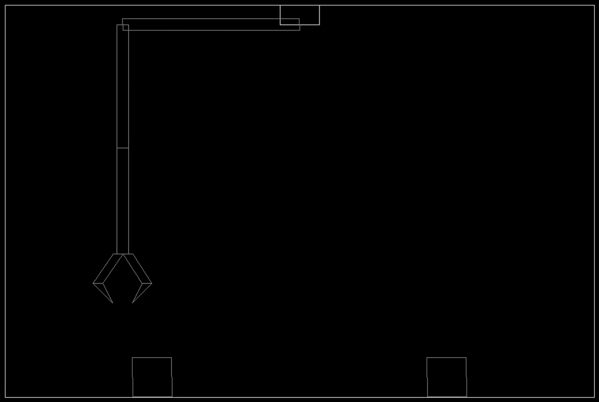
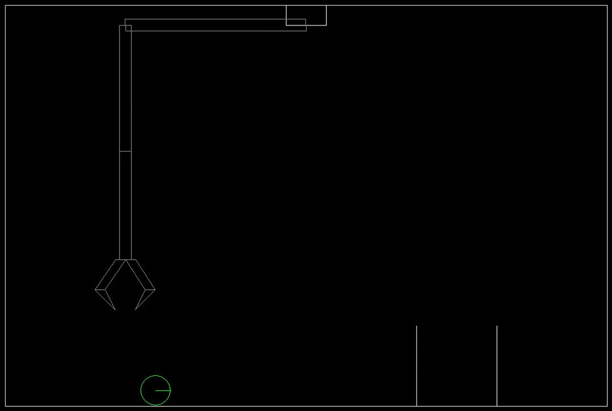
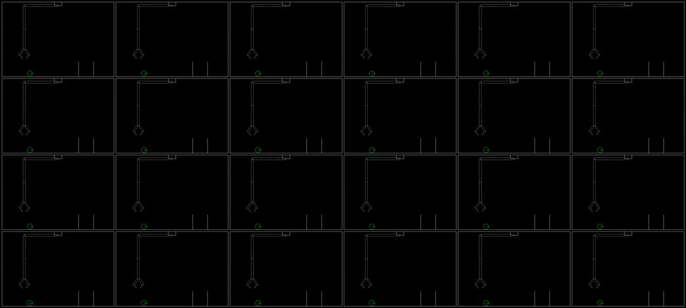

# RoboLab 🦾

RoboLab is a Gymnasium environment that simulates robotic arm control tasks using PyBox2D physics and PyGame rendering. RoboLab supports both single-instance and parallelized environments. The parallelized environment runs within a single Box2D world instance, fully leveraging Box2D’s C++ backend for efficiency. It features a variety of tasks, such as ball-dropping and box-stacking, through a modular task system. The codebase is designed for easy extension, making it well-suited for developing new tasks and conducting reinforcement learning research.


|||
|-|-|



## Install

```
conda env create -f environment.yml
```

## Run the examples

Run single robotic arm:

```
python -m examples.demo_arm
```

Run robotic arms in parallel:

```
python -m examples.demo_lab
```

## Debugging

For debugging the environments use interactive rendering 

```
python -m robolab.envs.robot_lab
python -m robolab.envs.robot_arm
```

## References

https://github.com/Farama-Foundation/Gymnasium

https://github.com/pybox2d/pybox2d/wiki/manual

https://github.com/pygame/pygame

## TODOs

- Fix size of render window.
- Normalize observations.
- Specify observation ranges.